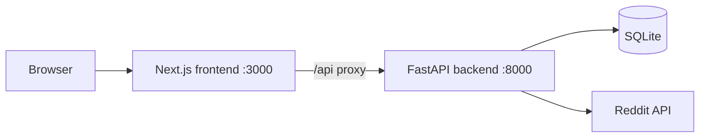

# Reddit Crawler

Integrated full-stack Reddit crawler assembled from the completed backend and frontend deliveries. The project exposes a FastAPI backend, a Next.js dashboard, Docker-based local orchestration, and a GitHub deployment workflow.

## Overview

- Frontend: Next.js App Router dashboard for crawl control, telemetry, data browsing, exports, settings, and session login.
- Backend: FastAPI API for crawler control, data retrieval, stats, export, settings persistence, and OpenAPI docs.
- Storage: SQLite by default for local development.

## Architecture



## Tech Stack

- Frontend: Next.js 16, React 19, TypeScript, TanStack Query, React Hook Form, Zod
- Backend: Python 3.12, FastAPI, SQLAlchemy, Pydantic, PRAW
- Dev tooling: Docker Compose, Vitest, Pytest

## Project Structure

```text
integrated-reddit-crawler/
├── backend/
├── frontend/
├── docker-compose.yml
├── .env.example
└── README.md
```

## Installation

### Backend

```bash
cd backend
python -m venv .venv
source .venv/bin/activate
pip install -r requirements.txt
cd ..
cp .env.example .env
python -m uvicorn backend.main:app --app-dir . --reload --port 8000
```

API docs:
- Swagger UI: `http://localhost:8000/docs`
- OpenAPI JSON: `http://localhost:8000/openapi.json`

### Frontend

```bash
cd frontend
cp .env.example .env.local
npm install
npm run dev
```

The frontend runs at `http://localhost:3000` and proxies `/api/*` requests to the backend via `API_PROXY_TARGET`.

## Run Together

```bash
cp .env.example .env
docker compose up --build
```

Services:
- Frontend: `http://localhost:3000`
- Backend: `http://localhost:8000`
- API docs: `http://localhost:8000/docs`

## Deployment Instructions

### GitHub Branch Setup

```bash
git checkout -b feature/todo-list-complete
```

### Remote Setup

```bash
git remote add origin https://github.com/ArabTooling/TODO-list.git
git push -u origin feature/todo-list-complete
```

### Pull Request

```bash
gh pr create \
  --repo ArabTooling/TODO-list \
  --base main \
  --head feature/todo-list-complete \
  --title "feat: integrate Reddit crawler frontend and backend" \
  --body "Connect frontend and backend, add root docs, Docker orchestration, and export/settings endpoints."
```

## Contributing

- Use feature branches.
- Keep backend and frontend changes atomic where possible.
- Run `pytest` and `npm test` before pushing.
- Update documentation when API or environment requirements change.

## License

MIT
