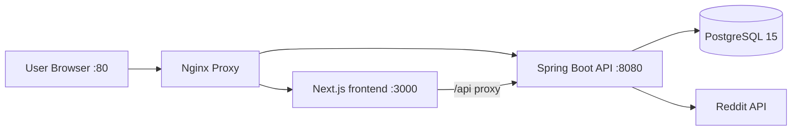

# Reddit Crawler

A production-ready Reddit crawling and analytics platform built with **Java Spring Boot 3.x**, **PostgreSQL**, and a modern **Next.js 16** frontend.

## Overview

- **Frontend**: Next.js 16 App Router dashboard for crawl control, telemetry, data browsing, exports, settings, and authentication
- **Backend**: Java Spring Boot 3.2 REST API with JWT authentication, Spring Security, and full CRUD operations
- **Database**: PostgreSQL 15 with Flyway versioned migrations
- **Deployment**: Docker Compose with multi-stage builds, health checks, and production-ready configuration

## Architecture



## Tech Stack

| Layer | Technology |
|-------|------------|
| **Frontend** | Next.js 16, React 19, TypeScript, TanStack Query, React Hook Form, Zod |
| **Backend** | Java 21, Spring Boot 3.2, Spring Security, JWT |
| **Database** | PostgreSQL 15, Flyway migrations, Spring Data JPA |
| **ORM** | Hibernate, MapStruct |
| **Security** | JWT tokens, BCrypt, Role-based access control |
| **DevOps** | Docker Compose, Multi-stage builds, Maven |
| **Docs** | Springdoc OpenAPI, Swagger UI |

## Project Structure

```text
integrated-reddit-crawler/
├── backend-java/           # Java Spring Boot backend
│   ├── src/main/java/
│   │   ├── controller/    # REST endpoints
│   │   ├── service/       # Business logic
│   │   ├── entity/        # JPA entities
│   │   ├── repository/    # Data access
│   │   ├── dto/           # Data transfer objects
│   │   ├── mapper/        # MapStruct mappers
│   │   ├── config/        # Configuration
│   │   └── security/      # Security filters
│   ├── src/main/resources/
│   │   ├── application.yml
│   │   └── db/migration/  # Flyway migrations
│   ├── Dockerfile
│   ├── mvnw
│   └── pom.xml
├── frontend/               # Next.js 16 frontend
│   ├── src/app/
│   ├── package.json
│   └── Dockerfile
├── docker-compose.yml      # Unified orchestration
├── nginx.conf              # Reverse proxy config
├── .env.example
└── README.md
```

## Quick Start

### Prerequisites

- Docker and Docker Compose
- Java 21 (for local development)
- Maven (for local development)
- Git

### One-Command Setup

```bash
# Clone and setup
git clone https://github.com/ArabTooling/TODO-list.git
cd TODO-list/integrated-reddit-crawler

# Copy environment files
cp .env.example .env

# Build and run
docker compose up --build -d
```

### Access Points

- **Frontend**: `http://localhost:3000`
- **API**: `http://localhost:8080`
- **API Docs**: `http://localhost:8080/swagger-ui.html`
- **Health Check**: `http://localhost:8080/api/health`

### Environment Variables

Copy `.env.example` to `.env` and configure:

```bash
# PostgreSQL
POSTGRES_PASSWORD=your_secure_password

# Spring Profile
SPRING_PROFILES_ACTIVE=dev

# Build Environment
BUILD_ENV=dev
```

## Docker Compose Profiles

### Full Stack (All Services)
```bash
docker compose --profile all up -d
```

### Backend Only
```bash
docker compose --profile backend up -d
```

### Frontend Only
```bash
docker compose --profile frontend up -d
```

### Production Mode
```bash
# Set production profile
export SPRING_PROFILES_ACTIVE=prod
export BUILD_ENV=prod

# Run with nginx proxy
docker compose --profile all up -d
```

## Development

### Backend Development

```bash
cd backend-java

# Run with Maven wrapper
./mvnw spring-boot:run -Dspring-boot.run.profiles=dev

# Build JAR
./mvnw clean package

# Run JAR
java -jar target/backend-java-1.0.0-SNAPSHOT.jar --spring.profiles.active=dev
```

**Backend Features:**
- JWT Authentication
- Role-based access control (ADMIN, OPERATOR, VIEWER)
- Swagger UI for API testing
- Health checks and version endpoint
- Pagination and search
- Full CRUD operations

### Frontend Development

```bash
cd frontend

# Install dependencies
npm install

# Run dev server
npm run dev
```

**Frontend Features:**
- Real-time crawl control dashboard
- Data browsing and search
- Export functionality
- Settings persistence
- Authentication UI

## API Endpoints

### Crawler Control
- `POST /api/crawler/start` - Start new crawl session
- `POST /api/crawler/stop/{sessionId}` - Stop active crawl
- `GET /api/crawler/status/{sessionId}` - Get session status
- `GET /api/crawler` - List all sessions
- `GET /api/crawler/subreddit/{name}` - Get subreddit-specific stats

### Posts API
- `GET /api/data/posts` - List posts with pagination
- `GET /api/data/posts/{id}` - Get single post
- `GET /api/data/posts/reddit/{redditId}` - Get by Reddit ID
- `GET /api/data/posts/subreddit/{subreddit}` - Filter by subreddit
- `GET /api/data/posts/search` - Full-text search

### Comments API
- `GET /api/data/comments` - List comments
- `GET /api/data/comments/{id}` - Get single comment
- `GET /api/data/comments/post/{id}` - Get by parent post

### Authentication
- `POST /api/auth/login` - JWT token generation
- `POST /api/auth/refresh` - Token refresh

### System
- `GET /api/health` - Health check
- `GET /api/version` - Version info

## Database Migrations

Flyway migrations are stored in `backend-java/src/main/resources/db/migration/`:

- `V1__init_extensions.sql` - User tables and extensions
- `V2__scraping_sessions.sql` - Session tracking
- `V3__posts.sql` - Posts table with indexes
- `V4__comments.sql` - Comments with parent-child recursion

## Security

### JWT Authentication

The application uses JWT tokens for authentication:

1. **Login** - User credentials → JWT token + refresh token
2. **Authorization** - Include `Authorization: Bearer <token>` in headers
3. **Token Validation** - JWTAuthenticationFilter validates tokens
4. **Role-Based Access** - Endpoints protected by `@PreAuthorize`

### Security Roles

- **ADMIN** - Full access, including user management
- **OPERATOR** - Crawl control and data access
- **VIEWER** - Read-only access

### CORS Configuration

Configured in `WebMvcConfig.java` to allow frontend origin only.

## Monitoring & Observability

### Health Check

```bash
curl http://localhost:8080/api/health
```

Response:
```json
{
  "status": "UP",
  "components": {
    "postgres": "UP",
    "diskSpace": "UP"
  }
}
```

### Version Info

```bash
curl http://localhost:8080/api/version
```

### Logs

```bash
# View all containers
docker compose logs -f

# View specific service
docker compose logs -f api
docker compose logs -f frontend
docker compose logs -f postgres
```

## Deployment

### GitHub Actions

Automated builds on push to `feature/todo-list-complete`:

```yaml
name: Build and Deploy
on:
  push:
    branches: [main, feature/*]

jobs:
  build:
    runs-on: ubuntu-latest
    steps:
      - uses: actions/checkout@v3
      - name: Set up JDK 21
        uses: actions/setup-java@v3
        with:
          java-version: '21'
          distribution: 'temurin'
      - name: Build with Maven
        run: |
          cd backend-java
          ./mvnw clean package
```

### Docker Registry

Build and push images:

```bash
# Build backend
docker build -t reddit-api:latest -f backend-java/Dockerfile backend-java

# Build frontend
docker build -t reddit-frontend:latest -f frontend/Dockerfile frontend

# Push to registry
docker push reddit-api:latest
docker push reddit-frontend:latest
```

### Production Checklist

- [ ] Set strong `POSTGRES_PASSWORD`
- [ ] Configure `SPRING_PROFILES_ACTIVE=prod`
- [ ] Enable SSL/TLS for database connections
- [ ] Set up monitoring (Prometheus + Grafana)
- [ ] Configure log aggregation (ELK stack)
- [ ] Enable JWT token rotation
- [ ] Set resource limits in Docker Compose
- [ ] Configure backup strategy for PostgreSQL

## Contributing

1. **Feature branches** - Always work on feature branches
2. **Atomic commits** - Keep changes focused and meaningful
3. **Tests** - Run `mvn test` and `npm test` before pushing
4. **Documentation** - Update README and API docs for changes
5. **Code review** - Create PRs for all changes

## Migration from Python Backend

**Migration Date**: April 5, 2026

Completed migration from Python FastAPI to Java Spring Boot:
- ✅ All 15+ API endpoints migrated
- ✅ PostgreSQL with Flyway migrations
- ✅ JWT authentication with Spring Security
- ✅ Production-ready Docker configuration
- ✅ Python backend completely removed

See `MIGRATION_SUMMARY.md` for complete details.

## License

MIT License - see LICENSE file for details.

---

**Built with ❤️ by the ArabTooling team**
